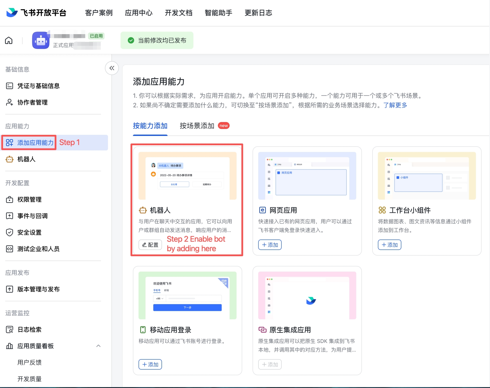
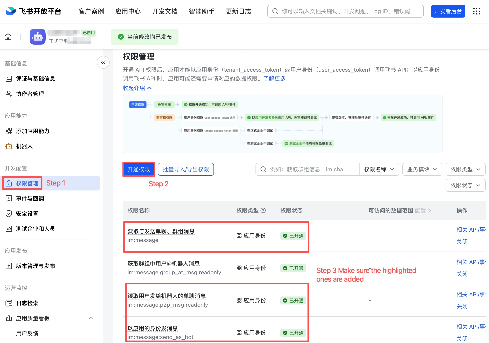
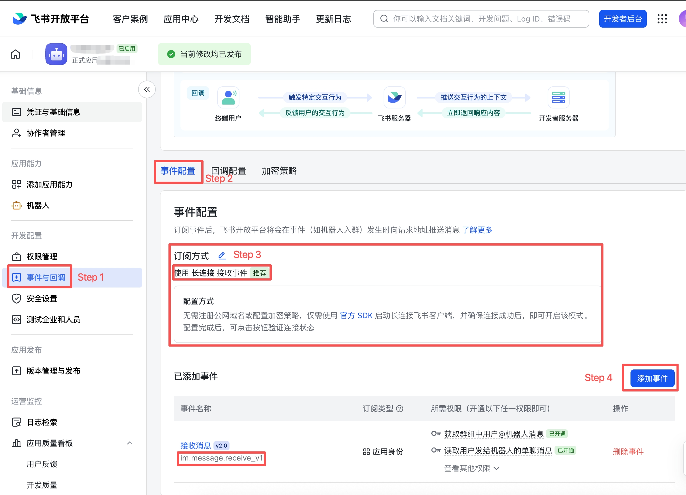
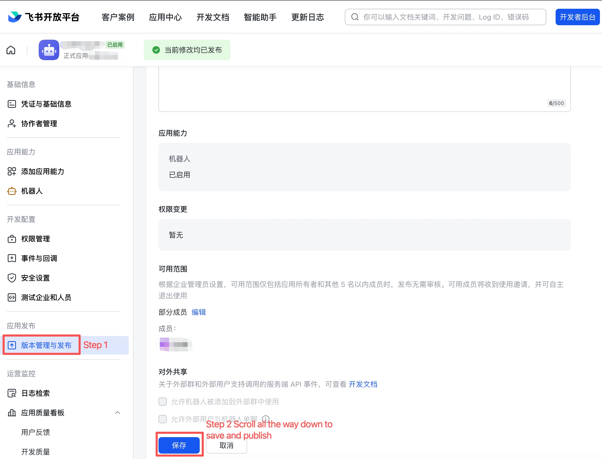

# codex-lark-minimal

[](https://github.com/xllakers/codex-lark-minimal/actions/workflows/test.yml)
[](LICENSE)

A minimal, local-first Feishu/Lark bridge that lets a chat bot start, track,
stop, and resume [Codex](https://github.com/openai/codex) jobs on your machine.

```
Feishu/Lark bot message  ──►  long-connection bridge  ──►  codex exec --json
```

## What this is — and isn't

**Is:** one agent (Codex), one platform (Feishu/Lark), one long-lived daemon
that spawns Codex as a subprocess per job. About 1.4K lines of Python plus a
single dependency (`lark-oapi`).

**Isn't:** a multi-platform/multi-agent control plane. No web UI, no live
mid-turn steering, no raw prompt/output persistence, no public webhook tunnel,
no in-chat tool-approval flow. If you need any of that, see
[Related projects](#related-projects) below.

Design principles, in priority order: **safe → minimalist → easy to maintain.**
See `AGENTS.md` for the full rules.

## Prerequisites

- macOS or Linux
- Python 3.9+
- [Codex CLI](https://github.com/openai/codex) installed and authenticated
  (`codex --version` should work)
- A Feishu or Lark account with permission to create a custom app

## Quick start

Three things to do: configure the Feishu app, run the installer, start the
daemon. Should take ~10 minutes.

> **Asking an AI agent (Codex, Claude Code, …) to install it for you?**
> Skip this README and point the agent at
> [`INSTALL_WITH_AGENT.md`](INSTALL_WITH_AGENT.md). It's a short playbook
> covering what to ask the human for and what to run itself.

### Step 1 — Create the Feishu app

Go to [open.feishu.cn](https://open.feishu.cn) (mainland China) or
[open.larksuite.com](https://open.larksuite.com) (global), click
**Console → Create Custom App**, and give it a name.

Then do four things in the dev console. Each is one panel and one screenshot.

#### 1a. Enable the Bot capability



1. Sidebar → **添加应用能力** (Add App Capabilities).
2. Click the **机器人** (Bot) tile to add it. Without this the app exists
   but can't send or receive messages.

#### 1b. Add three permissions



1. Sidebar → **权限管理** (Permissions).
2. Click **开通权限** (Enable permission).
3. Add and enable these three (search by ID):

   | Permission ID | Why |
   |---|---|
   | `im:message.p2p_msg:readonly` | **Receive DMs.** Without this, events are subscribed but never delivered — the #1 cause of "WS connects, no events arrive." |
   | `im:message:send_as_bot` | **Send replies.** |
   | `im:message.group_at_msg:readonly` | *Optional* — group `@bot` support. |

#### 1c. Subscribe to the message event



1. Sidebar → **事件与回调** (Events & Callbacks).
2. Open the **事件配置** (Event Configuration) tab.
3. Set **订阅方式** (Delivery method) to **长连接** (Long connection).
4. Click **添加事件** (Add event) and add `im.message.receive_v1`.

#### 1d. Publish a version



1. Sidebar → **版本管理与发布** (App Release).
2. Scroll to the bottom and click **保存** (Save and publish).

> ⚠️ **The bridge only sees the *released* version's settings.** Sidebar
> changes don't take effect until you publish a new version. After any
> change to permissions, events, or availability, re-publish.

Finally, copy **App ID** and **App Secret** from **凭证与基础信息**
(Credentials & Basic Info). The wizard asks for these two values and
nothing else.

### Step 2 — Run the installer

```bash
git clone https://github.com/xllakers/codex-lark-minimal.git
cd codex-lark-minimal
./install.sh
```

The installer creates an isolated venv at `~/.codex/bridges/codex-lark-minimal/`
and launches the **setup wizard**. The wizard:

1. Prompts only for App ID + App Secret (the two values from Step 1).
2. Validates them against Feishu's auth endpoint.
3. Opens a long connection and waits up to 180s. **DM your bot any
   message** — the wizard captures it and allowlists you automatically.
4. Writes everything to `config.env` (`chmod 600`).

### Step 3 — Start the daemon

```bash
codex-lark doctor                # verify config
codex-lark service install       # macOS LaunchAgent
codex-lark service start         # start the daemon
```

On Linux, run `codex-lark daemon` under systemd/tmux instead. Verify
end-to-end by DMing the bot:

```
codex help
```

The bot should reply with the command list within a second.

To start spawning real Codex jobs, register a workspace:

```bash
codex-lark configure --set FEISHU_CODEX_WORKSPACES=myproj=/path/to/myproj
```

Then DM `codex myproj: <your task>`. Sessions land in `~/.codex/sessions/` —
resumable from the Codex CLI's `resume` picker or with `codex exec resume <id>`.

---

### Re-run / skip the wizard

- `codex-lark setup` again — defaults pre-fill from current config.
- `./install.sh --no-setup` — install without the wizard; edit `config.env`
  by hand, then `codex-lark doctor`.

### Dry-run vs real mode

Mode is **derived from the allowlist**: empty `FEISHU_CODEX_ALLOWED_SENDERS`
and `FEISHU_CODEX_ALLOWED_CHATS` keeps the daemon in dry-run automatically
(events log, no Codex spawn). Populate either to go live. Set
`FEISHU_CODEX_DRY_RUN=1` to force dry-run with a populated allowlist
(useful for staging).

## Lark commands

Send these to the bot (replace `codex` with your `FEISHU_CODEX_TRIGGER_PREFIX`
if you changed it):

```
codex help
codex workspaces
codex status
codex status <run_id>
codex stop <run_id>
codex continue <run_id>: <follow-up instruction>
codex recent
codex <workspace-alias>: <task description>
```

`codex continue` only works on completed/idle Codex sessions started via the
bridge. For running jobs, stop them first or wait.

## Local CLI

```bash
codex-lark status                 # list recent bridge jobs
codex-lark status <run_id>        # show one job with redacted output tail
codex-lark recent                 # list Codex's own session index (resumable)
codex-lark simulate "codex status"  # parse a message without sending it
codex-lark doctor
```

The bridge's job state is the source of truth for what's running. Codex's own
session index is a recent/resume index only — not proof a thread is live.

## What is — and isn't — persisted

Persisted (under `~/.codex/bridges/codex-lark-minimal/state/`, `chmod 600`):

- run IDs, timestamps, status, PIDs, return codes
- **SHA-256** of the prompt + a redacted ~200-char preview
- a redacted, length-capped tail of Codex output (max 4 KB)
- the Codex session ID (for resume)

**Never** persisted by the bridge:

- raw prompts
- raw Codex JSONL output
- app secrets, tokens, or Codex auth (those live in `config.env` or
  `~/.codex/` and never touch bridge state)

Secret regex masking is applied to every log line, error message, and stored
tail (see `src/codex_lark_minimal/redaction.py`).

## Troubleshooting

- **WS connects but no events arrive.** `im:message.p2p_msg:readonly` is
  missing from the *released* version (see Step 1a). The event subscription
  alone isn't enough; Feishu requires the matching read scope for each chat
  type.
- **Bot doesn't reply.** Verify (1) the app's *released* version has the
  three settings from Step 1, (2) `codex-lark doctor` reports green, (3)
  `tail -f ~/.codex/bridges/codex-lark-minimal/logs/bridge.log` shows
  `inbound: ... prefix=yes` when you DM. `prefix=no` means your message
  didn't start with `codex` (the trigger word).
- **Dry-run despite a populated allowlist.** Look for `FEISHU_CODEX_DRY_RUN=1`
  in `config.env` — that overrides allowlist mode.
- **`env: node: No such file or directory` in `status <run_id>`.** macOS
  launchd has a minimal PATH. Re-run `codex-lark service install` from a
  shell with `node` on PATH; the installer captures it into the LaunchAgent
  plist.
- **`Codex CLI is referenced by basename`** (doctor warning) — set
  `FEISHU_CODEX_CODEX_BIN` to the absolute path the warning prints.
- **`config error: real mode requires ...`** — `FEISHU_APP_ID` /
  `FEISHU_APP_SECRET` missing while allowlist is set. Re-run `codex-lark
  setup` or clear the allowlist.
- **Persistent `lost` jobs** — a worker died between state writes. Safe to
  ignore; the bridge does not auto-restart by design.

## Development

Install with dev tools, then run the same three checks CI runs:

```bash
pip install -e ".[dev]"

ruff check src/ tests/    # lint
mypy                      # type check (lenient — strict is a separate effort)
pytest -q                 # ~50 tests, <1s
```

`make test` runs pytest only. CI (GitHub Actions, `.github/workflows/test.yml`)
runs all three on Python 3.9 and 3.12 for every push and PR.

Run the CLI from a checkout without installing:

```bash
PYTHONPATH=src python -m codex_lark_minimal.cli ...
```

Repo guardrails for AI agents live in `AGENTS.md` (read automatically by
Codex) and `CLAUDE.md` (which imports `AGENTS.md` for Claude Code). For
non-trivial changes, see the `skills/codex-lark-design` and
`skills/codex-lark-review` checklists.

## Related projects

If this repo's three principles (safe → minimalist → easy to maintain) don't
match what you need, two larger projects in the same space are worth a look:

| | This repo | [chenhg5/cc-connect](https://github.com/chenhg5/cc-connect) | [op7418/Claude-to-IM-skill](https://github.com/op7418/Claude-to-IM-skill) |
|---|---|---|---|
| **Language** | Python | Go | TypeScript |
| **Size** | ~1.4K LOC, 1 dep | binary + web UI, much larger | ~2.5k★, larger |
| **Agents** | Codex | 10+ (Codex, CC, Gemini, …) | Claude Code + Codex |
| **Chat platforms** | Feishu/Lark | 11 (Slack, Discord, Telegram, DingTalk, …) | 5 (Telegram, Discord, Feishu, QQ, WeChat) |
| **In-chat tool approval** | ❌ (out of scope) | ✅ `/mode` + per-tool prompt | ✅ SSE `canUseTool()` + inline buttons |
| **Live streaming** | ❌ | ✅ | ✅ |
| **Web admin UI** | ❌ | ✅ embedded | ❌ |
| **Install target** | local daemon + launchd | local daemon (npm/Homebrew) | drop-in `~/.claude/skills/` or `~/.codex/skills/` |
| **Default-deny + dry-run** | ✅ | partial | partial |

**Why pick this one over the others:** you want a small, single-purpose,
auditable bridge that you can read end-to-end in an afternoon. **Why pick
one of the others:** you need multiple platforms or agents, in-chat tool
approval, or live streaming, and you're willing to take on a much larger
codebase to get them.

> A small but real advantage of this project: it's plain Python with one
> dependency. For anyone who wants to *understand* and modify the bridge
> rather than just install it, that's an order of magnitude less code to read
> than a Go binary or a TypeScript codebase with a build step.

### Top things worth borrowing from cc-connect and Claude-to-IM-skill

Lessons we've taken from reading both — some applied here, some explicitly
declined as out of scope:

1. **Doctor commands that probe live, not just files.** Both projects ship
   diagnostic commands that hit the platform's auth endpoint to confirm the
   token actually works, not just that the env var is non-empty. (We do this
   too, in `src/codex_lark_minimal/doctor.py`.) Worth doing in any bridge.
2. **Allowlists per identity, not per network.** Neither project trusts the
   transport — both gate on stable IM-side identifiers (sender / chat ID).
   This is what makes "no public IP needed" actually safe.
3. **Secret redaction by *pattern*, not by registered token.** Both mask
   anything that looks like a token in logs without needing to know the value
   in advance. Cheap to add, catches the long tail.
4. **State directory is `chmod 600` and outside the repo.** Every serious
   variant puts state in `~/.<something>/`, not in the source tree. Stops
   accidental commits of run artifacts.
5. **(Declined) In-chat tool approval gateway.** Claude-to-IM's
   `canUseTool()` block-and-await pattern is genuinely clever, but it
   inverts the trust model — the IM becomes part of the control loop, not
   just a transport. Our `AGENTS.md` keeps live mid-turn steering out of
   scope on purpose.
6. **(Declined) Multi-platform abstraction.** cc-connect's per-platform
   adapter layer is well-designed, but every adapter is surface area. We'd
   rather one platform, well-understood.
7. **(Optional, worth porting) OS-user isolation.** cc-connect's
   `run_as_user` config lets the agent subprocess run under a different
   Unix uid. ~30 lines wrapping `subprocess.Popen` would add a real layer
   of defense for shared hosts. Open to a PR.
8. **(Optional, worth considering) Skill-first install.** Claude-to-IM lives
   in `~/.claude/skills/<name>/`, which makes it discoverable from inside
   the agent. A future version of this project could ship as an install
   target there in addition to `~/.codex/bridges/`.

## License

MIT — see [LICENSE](LICENSE).
